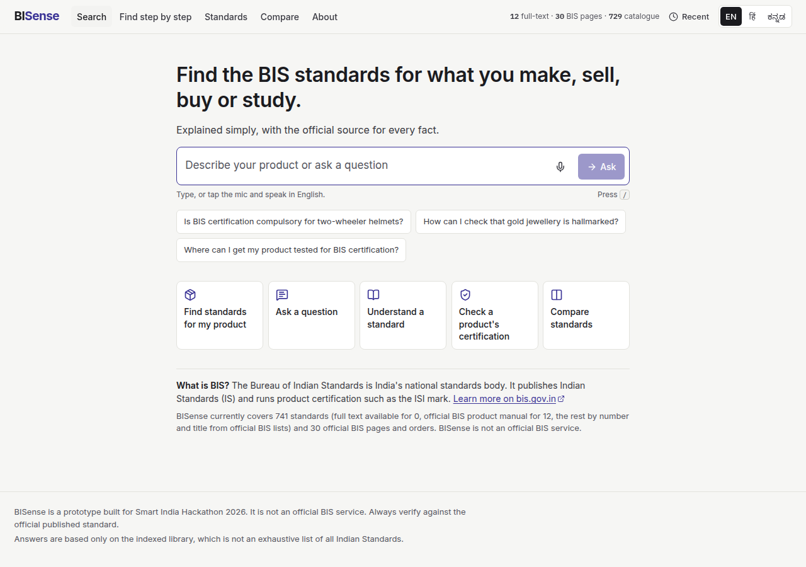
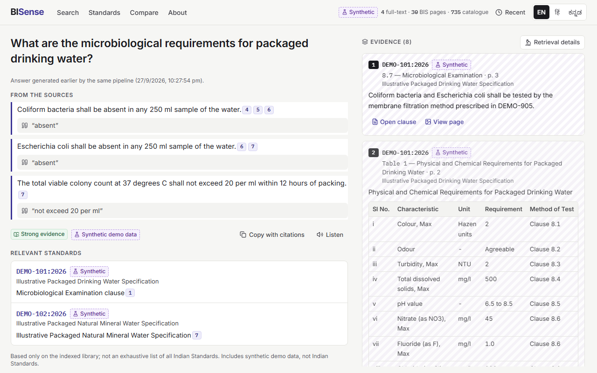
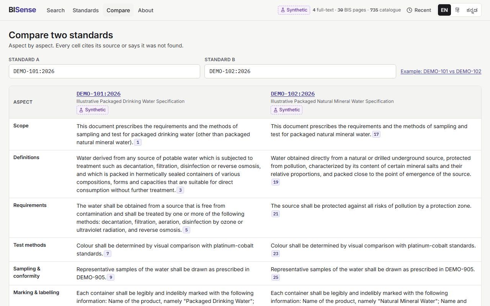
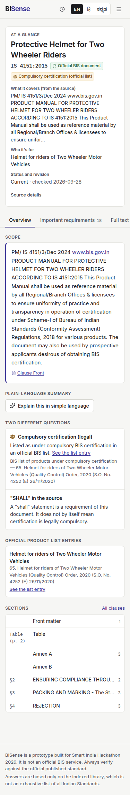
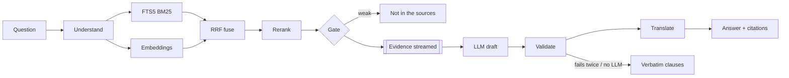

# BISense

**Find the Indian Standard that applies, and see the exact clause that says so.**

BISense is an evidence-first research assistant for Indian Standards and Bureau of Indian Standards (BIS)
services, built for **Smart India Hackathon 2026, problem statement SIH26107** — *AI-powered Intelligent
Assistant for Indian Standards and BIS Services for Industries and Consumers* (Ministry of Consumer Affairs,
Food & Public Distribution). The official statement is in [docs/PROBLEM_STATEMENT.md](docs/PROBLEM_STATEMENT.md).

> BISense is a prototype built for Smart India Hackathon 2026. It is not an official BIS service.
> Always verify against the official published standard.



## Why not just ask an LLM?

1. **Every fact is cited** — standard, clause, page and verbatim wording, from an indexed library only.
2. **It says when it doesn't know** — "This isn't stated in the indexed sources" instead of a guess.
3. **Source vs. interpretation** — what the document says is visibly separated from what the AI thinks it means.
4. **Requirements without generation** — SHALL/SHOULD/MAY statements are extracted deterministically and exported with clause references.
5. **Hindi and Kannada, safely** — standard numbers, clause numbers, units and quotes are protected during translation.
6. **Inspectable** — every answer has a "Retrieval details" drawer: candidates, scores, and every statement the validator removed.

## What works today

- **Ask** (`/ask`): natural-language questions in English, Hindi or Kannada, typed or spoken (browser speech). Evidence streams first; the answer arrives after a deterministic validator has checked every citation, quote, number, standard number, clause reference and URL. Follow-up questions keep the standard in scope (shown as a removable chip).
- **Discover and applicability**: product → standard mapping from the official BIS *Products under Compulsory Certification* lists (924 product rows, 735 standards). "Compulsory certification" badges appear only with that official evidence, kept separate from "SHALL in the source".
- **BIS services** (from the official problem statement): certification schemes (Scheme-I, FMCS, Scheme-X, CRS), grant-of-licence procedure, fees, hallmarking, laboratories, consumer complaints — answered from 30 official bis.gov.in pages and orders.
- **Standard explorer**: metadata and provenance, scope, clause tree with deep links (`?tab=clauses&clause=4.3.1`), page images with the quote highlighted, amendments, defined terms, references and "similar scope (computed)".
- **Requirements checklist**: filters, CSV export, print view, optional "plain language (AI)" labelled as interpretation.
- **Compare two standards**: aspect-by-aspect cells that each cite a source or say "Not found in the indexed text", plus a deterministic, verbatim numeric-limits table.
- **Honest refusal and graceful fallback**: evidence gate (no LLM call), extractive answers when no LLM key is set or the provider fails, cached answers from `npm run warm` for demos.
- **Library** with filters, typeahead and dataset-tier labels; **About** page with the real evaluation numbers.

| Ask (desktop) | Compare | Explorer (mobile) |
|---|---|---|
|  |  |  |

## Architecture



Details: [docs/ARCHITECTURE.md](docs/ARCHITECTURE.md). Decisions and their reasons: [docs/DECISIONS.md](docs/DECISIONS.md).

**Stack**: Python 3.12, FastAPI, Pydantic v2, SQLite + FTS5, NumPy vectors, fastembed (ONNX: `BAAI/bge-small-en-v1.5`, `Xenova/ms-marco-MiniLM-L-6-v2`), PyMuPDF, any OpenAI-compatible LLM (Groq, Gemini, OpenRouter or local Ollama); React 19, TypeScript, Vite, TanStack Query, Radix, Tailwind, i18next. One process, one port, no external services.

## Quick start

Prerequisites: **Python 3.11 or 3.12**, **Node.js 20+**, and [uv](https://docs.astral.sh/uv/) (recommended; without uv, `npm run setup` falls back to `python -m venv` + pip). Tesseract is optional (only for scanned PDFs). Every command below works in Windows PowerShell, macOS and Linux.

```bash
git clone <repo-url> bisense
```

```bash
cd bisense
```

```bash
npm run setup
```

`setup` creates `.env` from `.env.example`, installs Python and web dependencies, and downloads the embedding and reranker models (~100 MB, once). Optionally add a free LLM key to `.env` (see below); without one, answers use extractive mode.

```bash
npm run fetch-public
```

Downloads the official BIS pages listed in `data/public_sources.yaml` (needs internet once). Put real standards you obtained through official BIS channels in `data/raw/` (see [docs/DATA.md](docs/DATA.md)); otherwise the labelled synthetic demo pack is used.

```bash
npm run ingest
```

```bash
npm run warm
```

```bash
npm run demo
```

Open **http://127.0.0.1:8000**. `npm run doctor` checks the environment and prints fixes.

### Free LLM options

| Provider | `.env` | Notes |
|---|---|---|
| Groq (used for the eval below) | `LLM_BASE_URL=https://api.groq.com/openai/v1`, `LLM_MODEL=openai/gpt-oss-120b`, `LLM_API_KEY=…` | Free tier, no card; per-model rate limits (e.g. 30 requests/min). Key: console.groq.com/keys |
| Google Gemini | `LLM_BASE_URL=https://generativelanguage.googleapis.com/v1beta/openai`, `LLM_MODEL=gemini-2.5-flash` | Free tier key at aistudio.google.com |
| Ollama (offline) | `LLM_BASE_URL=http://localhost:11434/v1`, `LLM_MODEL=llama3.2` | Start Ollama with `OLLAMA_CONTEXT_LENGTH=8192`. Also useful as `LLM_FALLBACK_*`. |

Keys live only in `.env` (gitignored), are never sent to the browser and never logged. Model availability changes — check the provider's model list.

## Environment variables

| Variable | Default | Purpose |
|---|---|---|
| `DATASET` | `auto` | `auto` (A+B if `data/raw` has PDFs, else B+C), `real`, `demo` |
| `LLM_PROVIDER` | `openai_compatible` | or `none` (extractive only), `fake` (tests) |
| `LLM_BASE_URL`, `LLM_API_KEY`, `LLM_MODEL` | — | primary LLM |
| `LLM_FALLBACK_*` | — | second provider tried on error/timeout |
| `LLM_TIMEOUT_S` | `20` | per call |
| `DEMO_MODE` | `false` | live first, then warmed cache, then extractive |
| `RERANK_ENABLED` | `true` | cross-encoder reranking for `/api/ask` |
| `GATE_RERANK_MIN` / `GATE_RERANK_MIN_NO_LLM` | `-4.0` / `1.0` | evidence gate (see docs/EVAL.md) |
| `ONNX_THREADS` | `2` | CPU threads per ONNX model at query time |
| `RATE_LIMIT_ASK` | `20/minute` | per IP, for ask/compare/summary/voice |
| `DEBUG` | `false` | enables `/api/debug/trace/{id}` and `/api/docs` |

All variables with comments: [.env.example](.env.example).

## Development

```bash
npm run dev
```

API with auto-reload on :8000 and the Vite dev server on :5173 (proxying `/api`). Other tasks: `npm run inspect -- <slug> --clause 4.2`, `npm run search:explain -- "query"`, `npm run gen:types` (regenerates `web/src/api/types.gen.ts` from the Pydantic models), `npm run lint`, `npm run typecheck`, `npm run test`, `npm run e2e`, `npm run check` (all quality gates: ruff, mypy, eslint, tsc, pytest, vitest, web build, eval smoke).

Database: SQLite, created by `npm run ingest` in `data/index/` (never committed; rebuildable). Data tiers, manifest fields, adding real standards and troubleshooting: [docs/DATA.md](docs/DATA.md).

## Testing and evaluation

- **Backend**: 125 pytest tests — standard-number normalisation (23 cases), clause parsing and regressions, watermark stripping, tables, chunk boundaries, modality, FTS escaping with malicious input, RRF, gate, the adversarial validator suite (fabricated citations, fake quotes, invented numbers and standard numbers, prompt-injection consequences), placeholder protection, context resolution, cache keys, ingestion idempotency, Tier C labelling, every API endpoint, SSE order, rate limit.
- **Frontend**: Vitest (i18n key parity, Markdown never renders raw HTML, citation chips, source-fact vs interpretation labels, SSE parsing, spoken-number normalisation).
- **End-to-end**: 13 Playwright tests on desktop and 390×844 mobile with axe accessibility checks and zero console errors.
- **Evaluation** (`npm run eval`, 62 questions incl. 9 Hindi/Kannada, 12 unanswerable; dataset: official BIS pages + synthetic demo pack). Latest real results are in [docs/EVAL.md](docs/EVAL.md) and on the About page. Latest run (Groq `openai/gpt-oss-120b`, translation `openai/gpt-oss-20b`, 2026-09-28): recall@5 1.00, MRR@10 0.90, exact-number hit@1 1.00, refusal accuracy 1.00, false-refusal rate 0.06, validator drop rate 0.007, fact hit 0.91, answer p50 ≈ 5.6 s (p95 ≈ 13 s). Without an LLM (extractive mode): recall@5 1.00, refusal accuracy 0.83, false refusals 0.02. The demo-pack numbers measure the pipeline, not coverage of real Indian Standards.

## Build and deployment

```bash
npm run build
```

```bash
npm run start
```

Docker (one multi-stage image; the index is built at container start from the mounted `data/`):

```bash
docker build -t bisense .
```

```bash
docker run -p 8000:8000 --env-file .env -v "./data:/app/data" bisense
```

Cloud: any container host that runs a Docker image and exposes one port works (`/api/health` is the health check; expect a cold start of ~20–60 s while models load and the index builds). We could not confirm a currently free container host: Hugging Face changed its free CPU Docker Spaces in mid-2026, so check a host's current terms first. **A public deployment exposes the indexed text** — deploy privately, or publish only the synthetic demo pack and official public pages. Set secrets in the host's settings, never in the image.

## Known limitations

- No real Indian Standard full texts are bundled (they require official BIS access); the four clause-level demo documents are synthetic and labelled everywhere. Real PDFs drop in through `data/raw/` + ingestion.
- Certification status comes only from the official BIS lists indexed on their retrieval date.
- Scanned PDFs need Tesseract; legacy-font Hindi text is excluded rather than indexed as garbage.
- The cross-encoder costs ~0.5–1.5 s per question on a laptop CPU; answers take ~3–10 s with a fast free-tier LLM.
- Hindi and Kannada UI strings are drafts awaiting native-speaker review (list in docs/TEAM_GUIDE.md).
- Voice input depends on the browser (Chrome/Edge); server STT/TTS providers are not implemented.

## Future improvements

Real Tier A corpus (IS 14543, IS 13428, IS 10500, IS 1786, IS 4151, …), a multilingual embedding model evaluated against the English pivot, server-side STT for browsers without speech recognition, scheduled refresh of the official lists, reference-graph visualisation, dark mode.

## Licences and notes

- PyMuPDF is **AGPL-3.0**: distributing BISense as a network service with PyMuPDF has AGPL obligations; pdfplumber is the documented alternative.
- Official BIS pages and orders are fetched for local indexing with their source URL and date; they are not redistributed in this repository. Indian Standards are copyright BIS — never commit them.
- The synthetic demo pack (`data/demo/`) is original content created for this project.
- Team guide (code map, who explains what, recipes, glossary): [docs/TEAM_GUIDE.md](docs/TEAM_GUIDE.md). Demo script: [docs/DEMO_SCRIPT.md](docs/DEMO_SCRIPT.md).
