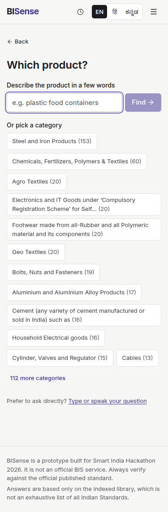
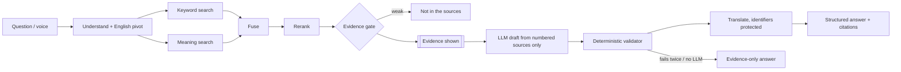

# BISense

**Find the BIS standards for what you make, sell, buy or study — explained simply, with the official source for every fact.**

BISense is an evidence-first assistant for Indian Standards and Bureau of Indian Standards (BIS) services,
built for **Smart India Hackathon 2026, problem statement SIH26107** — *AI-powered Intelligent Assistant for
Indian Standards and BIS Services for Industries and Consumers* (Ministry of Consumer Affairs, Food & Public
Distribution). The official statement is in [docs/PROBLEM_STATEMENT.md](docs/PROBLEM_STATEMENT.md).

> BISense is a prototype built for Smart India Hackathon 2026. It is not an official BIS service.
> Always verify against the official published standard.


## The problem

Small manufacturers, sellers and consumers struggle to find which Indian Standard applies to a product,
what it requires, and whether certification is compulsory. The information exists on bis.gov.in, in product
manuals and in government orders, but it is scattered, technical and English-only. A general chatbot guesses.

## What BISense does

- **Ask in plain words, by typing or speaking, in English, हिंदी or ಕನ್ನಡ.** One language setting drives the
  screen, the microphone, the answer and the read-aloud voice.
- **Short, structured answers**: a short answer, up to five key points *from the source*, "What this means
  for you" (clearly labelled AI interpretation), the relevant standards as simple cards, the sources as
  human citations ("Bureau of Indian Standards · Product Manual for IS 4151:2015 · Section 2 · Page 2"),
  and next steps ("See the important requirements", "Explain simply", "Compare", "Ask in हिंदी").
- **Honest when it doesn't know**: "This isn't stated in the indexed sources", with what was searched and
  what to try (guided path, browse by category). No guess.
- **Guided path** for people who don't know what to search: *What are you looking for?* → product,
  industry, testing, safety, quality or certification → a product description or a category from the data.
- **Standard pages**: an "At a glance" card (what it covers, who it's for, status and revision, source
  badge), then *Important requirements*, *Full text & clauses*, *Related & compare*, *Ask about this*.
- **Expert tools stay one tap away**: exact standard-number search, clause deep links, verbatim evidence with
  the page image highlighted, metadata, side-by-side comparison with a verbatim numeric table, requirements
  CSV and checklist, and "Retrieval details" (interpreted query, passages and scores, what was cited, removed
  statements, timings, live / cached / evidence-only).

| Answer (desktop) | Guided path (mobile) | Standard page (mobile) |
|---|---|---|
|  |  |  |

## Data: official by default

`DATASET=official` (default) indexes only official sources, each with URL, retrieval date and a
plain-language source badge:

| Tier | What | Badge |
|---|---|---|
| A | Official BIS documents: 12 BIS product manuals and licensing guidelines (bis.gov.in); Indian Standards the team downloads with its own BIS account (`data/raw/`) | Official BIS document |
| B | Official BIS website: certification schemes, FAQs, hallmarking, labs, consumer pages; the lists of products under compulsory certification (924 product → standard rows) | Official BIS website |
| C | Government notifications: Quality Control Orders (e.g. Helmet QCO 2020) | Government notification |
| D | Sample documents written for this project — **off by default**; with `DATASET=sample` they are labelled "Sample data, not official" everywhere | Sample data, not official |

Official files are downloaded by `npm run fetch-public` (allow-list in `data/public_sources.yaml`, robots.txt
respected, 3 s between requests) and are **not** committed. Standards known only from the official lists
answer "what is it / what does it cover"; for clause questions BISense says the full text isn't available
and links the official source. Details, provenance fields, ingestion of your own licensed PDFs and
re-verification: [docs/DATA.md](docs/DATA.md).

## How an answer is made



The validator removes any statement whose citation, quote, number or standard number is not in the cited
source. Retrieved text is treated as untrusted data (separate channel, delimited blocks, no tools).
Details: [docs/ARCHITECTURE.md](docs/ARCHITECTURE.md). Decisions: [docs/DECISIONS.md](docs/DECISIONS.md).

**Stack**: Python 3.12, FastAPI, Pydantic v2, SQLite + FTS5, NumPy, fastembed (ONNX: `BAAI/bge-small-en-v1.5`,
`Xenova/ms-marco-MiniLM-L-6-v2`), PyMuPDF, any OpenAI-compatible LLM (Groq, Gemini or local Ollama), Groq
Whisper for speech-to-text; React 19, TypeScript, Vite, TanStack Query, Radix, Tailwind, i18next. One process,
one port.

## Quick start

Prerequisites: **Python 3.11 or 3.12**, **Node.js 20+**, [uv](https://docs.astral.sh/uv/) (recommended; without
uv, `npm run setup` falls back to `python -m venv` + pip). Every command works in Windows PowerShell, macOS and Linux.

```bash
git clone <repo-url> bisense
```

```bash
cd bisense
```

```bash
npm run setup
```

Creates `.env` from `.env.example`, installs dependencies and downloads the search models (~100 MB, once).

```bash
npm run fetch-public
```

```bash
npm run ingest
```

```bash
npm run demo
```

Open **http://127.0.0.1:8000**. `npm run doctor` checks the environment and prints fixes; `/api/health` reports
index coverage, the LLM, speech, translation per language and the reranker state, each with a plain fix.
For a demo day, also run `npm run warm` (with internet) so every demo question has a cached answer produced by
the real pipeline ([docs/DEMO_SCRIPT.md](docs/DEMO_SCRIPT.md)).

### Free keys (all optional)

| What | `.env` | Where to get a free key |
|---|---|---|
| LLM (answers, summaries, translation) | `LLM_BASE_URL=https://api.groq.com/openai/v1`, `LLM_MODEL=openai/gpt-oss-120b`, `LLM_ALT_MODEL=openai/gpt-oss-20b`, `TRANSLATION_MODEL=openai/gpt-oss-20b`, `LLM_API_KEY=…` | console.groq.com/keys (free tier, no card) |
| LLM alternative | `LLM_BASE_URL=https://generativelanguage.googleapis.com/v1beta/openai`, `LLM_MODEL=gemini-2.5-flash` | aistudio.google.com |
| Offline LLM | `LLM_BASE_URL=http://localhost:11434/v1`, `LLM_MODEL=llama3.2` | ollama.com (start with `OLLAMA_CONTEXT_LENGTH=8192`) |
| Speech-to-text (en, hi, kn) | nothing extra with a Groq LLM key (same key reused); or `STT_API_KEY` | Groq (Whisper `whisper-large-v3-turbo`) |
| Server voice (English) | nothing extra with a Groq key; accept the Orpheus model terms once in the Groq console | Groq (`canopylabs/orpheus-v1-english`) |

Without any key BISense still works: evidence-only answers ("AI summary unavailable right now; here is what
the sources say"), browser speech recognition in Chrome/Edge, device voices for read-aloud, typing always.
Keys live only in `.env` (gitignored), are never sent to the browser and never logged.

## Voice and languages

| | English | हिंदी | ಕನ್ನಡ |
|---|---|---|---|
| Screen text | yes | yes (draft, native review pending) | yes (draft, native review pending) |
| Questions | yes | yes (LLM pivot; glossary keywords without an LLM) | same |
| Answers | yes | translated after validation, identifiers protected (needs LLM) | same |
| Microphone (server) | Groq Whisper | Groq Whisper | Groq Whisper |
| Microphone (no key) | browser recognition (Chrome/Edge) | browser recognition where supported | browser recognition where supported |
| Read-aloud | server voice (Groq) or device voice | device voice if installed | device voice if installed (often missing on desktops; the UI says so) |

Quoted source text is never translated in place; an optional "Show translation" under each passage is
labelled as machine translation. Adding a language = one registry entry + one strings file.

### Serving over HTTPS (microphone on a phone)

Browsers allow the microphone only on `https://` or `localhost`. Opening `http://<laptop-ip>:8000` on a phone
silently blocks it. Options: open the app on the laptop itself; or use a tunnel that gives an HTTPS URL
(e.g. `cloudflared tunnel --url http://127.0.0.1:8000`), or put a local reverse proxy with a trusted
certificate (e.g. `mkcert` + Caddy) in front of port 8000. Test the manual check in
[docs/VERIFICATION.md](docs/VERIFICATION.md) before the demo.

## Environment variables

| Variable | Default | Purpose |
|---|---|---|
| `DATASET` | `official` | `official` (tiers A–C) or `sample` (adds labelled Tier D sample documents) |
| `LLM_PROVIDER` | `openai_compatible` | or `none` (evidence-only), `fake` (tests) |
| `LLM_BASE_URL`, `LLM_API_KEY`, `LLM_MODEL`, `LLM_ALT_MODEL`, `LLM_FALLBACK_*` | — | LLM, second model on rate limit, second provider |
| `TRANSLATION_MODEL` | — | model used to translate answers (same provider) |
| `STT_PROVIDER`, `STT_*`; `TTS_PROVIDER`, `TTS_*` | `auto` | server speech; `none` to switch off |
| `DEMO_MODE` | `false` | live first, then warmed cache, then evidence-only |
| `RERANK_ENABLED` | `true` | cross-encoder reranking |
| `GATE_RERANK_MIN` / `GATE_RERANK_MIN_NO_LLM` | `-4.0` / `1.0` | evidence gate (calibrated in docs/EVAL.md) |
| `GATE_VECTOR_MIN` / `GATE_TERM_COVERAGE_NO_LLM` | `0.62` / `0.6` | gate used only if the reranker model is missing |
| `RATE_LIMIT_ASK` | `20/minute` | per IP, for ask/compare/translate/voice |
| `DEBUG` | `false` | enables `/api/debug/trace/{id}` and `/api/docs` |

Every variable with comments: [.env.example](.env.example) (a test fails if it names a setting the code doesn't have).

## Development and testing

```bash
npm run dev
```

API with auto-reload on :8000 and Vite on :5173. Other tasks: `npm run inspect -- <slug> --clause 4.2`,
`npm run search:explain -- "query"`, `npm run gen:types`, `npm run lint`, `npm run typecheck`, `npm run test`,
`npm run e2e`, `npm run check` (ruff, mypy, eslint, tsc, pytest, vitest, build, eval smoke).

- **Backend (pytest)**: 149 tests + 14 that need official data or a live key. Includes the RAG proofs
  (`test_rag_mechanism.py` always; `test_rag_proof.py` on official data): known-answer, ablation (remove the
  document → the fact disappears, even from a model that "knows" it), refusal before any LLM call, prompt
  injection; the adversarial validator suite; provenance on every record; watermark stripping; voice
  endpoints with real audio fixtures; translation identifier protection.
- **Frontend (vitest)**: string parity across en/hi/kn, answer section order and labels, collapsed evidence,
  citation chips, spoken standard numbers ("I S fourteen five four three" → "IS 14543").
- **End-to-end (Playwright)**: 26 tests on desktop, 390 px mobile and a fake-microphone Chrome; axe
  accessibility checks; any console error fails a test. Use `PW_CHROMIUM_PATH` to point at an installed Chromium.
- **Evaluation**: `npm run eval` — 63 questions (English, Hindi, Kannada, unanswerable). Latest full run and
  its date: [docs/EVAL.md](docs/EVAL.md).
- What was verified how, and the manual checks left for a person: [docs/VERIFICATION.md](docs/VERIFICATION.md).

## Build and deployment

```bash
npm run build
```

```bash
npm run start
```

Docker (the index is built at container start from the mounted `data/`):

```bash
docker build -t bisense .
```

```bash
docker run -p 8000:8000 --env-file .env -v "./data:/app/data" bisense
```

Any container host with one open port works (`/api/health` is the health check). A public deployment
exposes the indexed text: keep licensed standards private. Set secrets in the host's settings, never in the image.

## Known limitations

- Most standards are covered by their official product manual or list entry, not their full text (full texts
  need a BIS account; drop licensed PDFs into `data/raw/` and run `npm run ingest`).
- Certification status comes only from the official lists and orders, as of their retrieval date.
- Server voice speaks English only (Groq); Hindi/Kannada read-aloud depends on the device's voices.
- Hindi and Kannada strings and glossary entries await native-speaker review.
- Without both the reranker model and an LLM, refusals are weaker (11 of 12 in the eval) — run `npm run setup` once online.
- Answers take ~3–10 s with a free-tier LLM on a laptop CPU.

## Future improvements

More licensed full texts, a multilingual embedding model compared against the English pivot, an Indian-language
TTS/STT provider (e.g. Bhashini or Sarvam) for Hindi/Kannada voices, scheduled refresh of the official lists.

## Licences and notes

- PyMuPDF is **AGPL-3.0**; pdfplumber is the documented alternative if that matters for a deployment.
- Official BIS files are fetched for local indexing with source URL and date and are not redistributed here.
  Indian Standards are copyright BIS — never commit them.
- The sample documents (`data/demo/`) and the audio fixtures' licences are described next to them.
- Team guide: [docs/TEAM_GUIDE.md](docs/TEAM_GUIDE.md). Progress: [docs/PROGRESS.md](docs/PROGRESS.md).
  Reality audit: [docs/REALITY_AUDIT.md](docs/REALITY_AUDIT.md).
