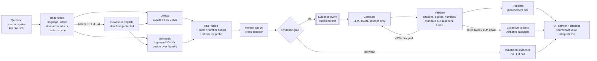

# Architecture

BISense is one Python process (FastAPI) that serves a JSON/SSE API and the built React app, plus a
SQLite file and a NumPy matrix on disk. There are no other services.

## Components

| Area | Code | What it does |
|---|---|---|
| Ingestion | `server/bisense/ingest/` | PDF (PyMuPDF) and HTML (BeautifulSoup) → clause tree with page numbers, tables as Markdown, deterministic requirements/terms/references/amendments, official product→IS mappings, chunks, embeddings. Cached per file; the database is rebuilt atomically. |
| Index | `data/index/` | `bisense.db` (SQLite: documents, standards, clauses, chunks, FTS5, requirements, terms, refs, product_mappings, answer_cache, meta), `embeddings.npy`, `chunk_ids.npy`, `ingest_report.json`. |
| Retrieval | `server/bisense/retrieval/` | `query.py` understanding and context, `lexical.py` FTS5 with escaped input, `vector.py` cosine, `fuse.py` RRF, `rerank.py` cross-encoder, `search.py` orchestration, product probe, clause lookup, grouping. |
| Answering | `server/bisense/answer/` | `generate.py` prompts with separated channels, `validate.py` deterministic checks, `extractive.py` fallback, `confidence.py` evidence strength, `cache.py`, `ask.py` SSE pipeline, `compare.py`, `plain.py`. |
| Multilingual | `server/bisense/i18n/` | language registry, glossary (synonyms + offline HI/KN keywords), placeholder protection, translation. |
| API | `server/bisense/api/` + `main.py` | FastAPI routes, rate limit, error codes, security headers, SPA serving, warm-up. |
| Web | `web/src/` | React + TypeScript + Vite, TanStack Query, Radix primitives, Tailwind tokens, i18next (en/hi/kn), generated API types. |

## Key design choices (details in DECISIONS.md)

- **Evidence first, answer second.** The SSE stream sends retrieved passages before the LLM runs; the
  answer is sent only after validation. Raw LLM tokens are never streamed.
- **The validator is the trust boundary.** Any statement the sources cannot support is removed and the
  removal is visible in "Retrieval details".
- **Honest refusal is cheap.** The gate refuses before any LLM call when the best passage is weak.
- **Stateless server.** Conversation context (last 2 questions, focused standard ids) comes from the
  browser with each request; previous AI answers are never fed back to the model.
- **English pivot.** Retrieval, generation and validation happen in English; only validated strings are
  translated, with numbers, units, standard numbers, clause references and citation markers protected.
- **No LLM required.** With no key, search, explorer, requirements, compare (verbatim cells) and
  extractive answers all work offline.

## Request flow for `/api/ask`

1. `understand` → `QueryInfo` event (interpreted query, intent, resolved scope).
2. `retrieve` → `evidence` event (citations C1..Cn with scores, grouped standards).
3. gate → insufficient evidence (no LLM), or clarification for "my product" without a product.
4. cache check (non-demo mode) → cached answer if the same question was answered for this index version.
5. generate → validate → (retry once with the list of failures) → extractive fallback if still failing.
6. translate (HI/KN) → evidence strength → cache → `answer` event → `trace` event → `done`.
